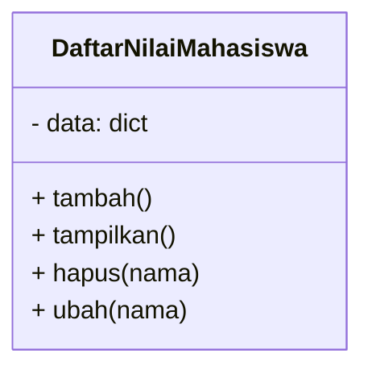

# Program Daftar Nilai Mahasiswa


## 1. Kode Program

```python
class DaftarNilaiMahasiswa:
    def __init__(self):
        self.data = {}

    def tambah(self):
        nama = input("Masukkan nama mahasiswa: ")
        nilai = float(input("Masukkan nilai: "))
        self.data[nama] = nilai
        print("Data berhasil ditambahkan.\n")

    def tampilkan(self):
        if not self.data:
            print("Belum ada data.\n")
            return
        print("\nDaftar Nilai Mahasiswa:")
        for nama, nilai in self.data.items():
            print(f"- {nama}: {nilai}")
        print()

    def hapus(self, nama):
        if nama in self.data:
            del self.data[nama]
            print(f"Data '{nama}' berhasil dihapus.\n")
        else:
            print("Nama tidak ditemukan.\n")

    def ubah(self, nama):
        if nama in self.data:
            nilai = float(input("Masukkan nilai baru: "))
            self.data[nama] = nilai
            print("Data berhasil diubah.\n")
        else:
            print("Nama tidak ditemukan.\n")

# Program utama
if __name__ == "__main__":
    daftar = DaftarNilaiMahasiswa()

    while True:
        print("=== Menu ===")
        print("1. Tambah Data")
        print("2. Tampilkan Data")
        print("3. Hapus Data")
        print("4. Ubah Data")
        print("5. Keluar")
        pilih = input("Pilih menu: ")

        if pilih == "1":
            daftar.tambah()
        elif pilih == "2":
            daftar.tampilkan()
        elif pilih == "3":
            nama = input("Masukkan nama yang akan dihapus: ")
            daftar.hapus(nama)
        elif pilih == "4":
            nama = input("Masukkan nama yang akan diubah: ")
            daftar.ubah(nama)
        elif pilih == "5":
            print("Keluar dari program.")
            break
        else:
            print("Pilihan tidak valid.\n")
```

---

## 2. Class Diagram (Mermaid)



---

## 3. Flowchart Program (Mermaid)

```mermaid
flowchart TD
    A([Mulai]) --> B{Pilih Menu}
    B -->|1| C[tambah()]
    C --> B
    B -->|2| D[tampilkan()]
    D --> B
    B -->|3| E[Input nama hapus]\nE --> F[hapus(nama)]
    F --> B
    B -->|4| G[Input nama ubah]\nG --> H[ubah(nama)]
    H --> B
    B -->|5| I([Selesai])
    B -->|Lainnya| B
```

---

## 4. Penjelasan Program

Program ini menggunakan satu kelas bernama **DaftarNilaiMahasiswa**, yang menyimpan data mahasiswa dalam bentuk dictionary (`{nama: nilai}`).

### Penjelasan method:

* **tambah()** → meminta input nama & nilai, kemudian menyimpannya ke dictionary.
* **tampilkan()** → menampilkan seluruh data yang sudah disimpan.
* **hapus(nama)** → menghapus data mahasiswa berdasarkan nama jika ditemukan.
* **ubah(nama)** → mengubah nilai mahasiswa berdasarkan nama jika ditemukan.

Pada bagian **program utama**, menu interaktif disediakan dalam loop sehingga user dapat memilih aksi yang ingin dilakukan.

Diagram Class
+--------------------------------------+
|        DaftarNilaiMahasiswa          |
+--------------------------------------+
| - data : dictionary                  |
+--------------------------------------+
| + tambah()                           |
| + tampilkan()                        |
| + hapus(nama)                        |
| + ubah(nama)                         |
+--------------------------------------+


Flowchart
                +----------+
                |  Mulai   |
                +----------+
                      |
                      v
              +----------------+
              |   Pilih Menu   |
              +----------------+
          /        |        |        |        \
         v         v        v        v         v
   +-----------+ +-----------+ +-----------+ +-----------+ +-----------+
   | Tambah    | | Tampilkan | | Hapus     | |  Ubah     | |  Keluar   |
   |   Data    | |   Data    | |  Data     | |   Data    | |           |
   +-----------+ +-----------+ +-----------+ +-----------+ +-----------+
        |             |             |             |            |
        v             v             v             v            v
   (Kembali ke menu)  (Kembali ke menu)  (Kembali ke menu)  (Kembali ke menu)
                                                           atau selesai
                      |
                      v
                 +----------+
                 | Selesai  |
                 +----------+
